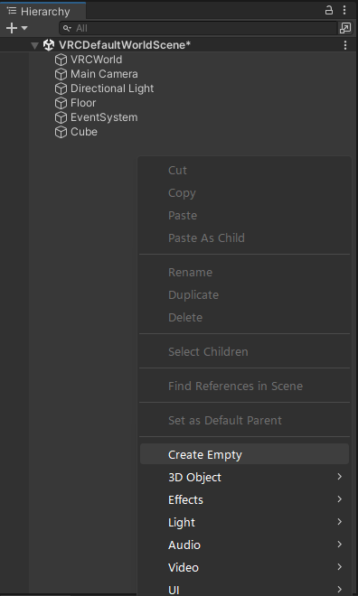
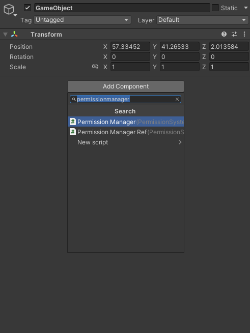
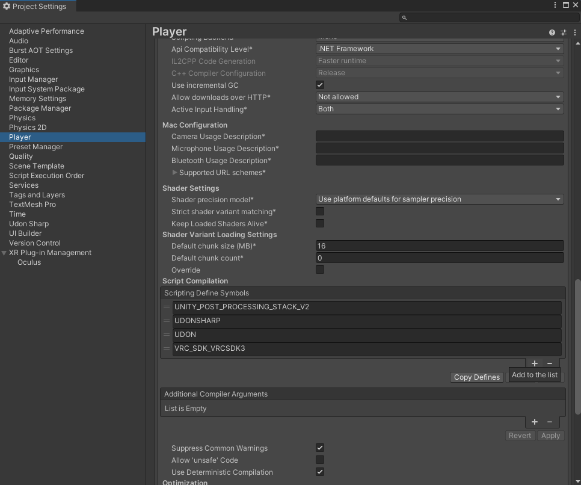
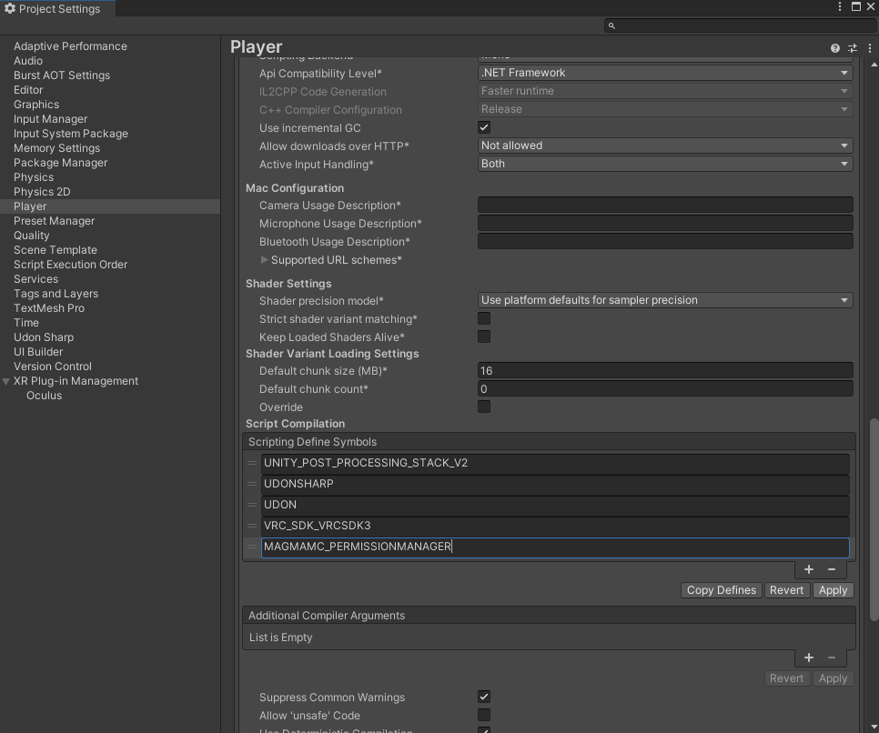
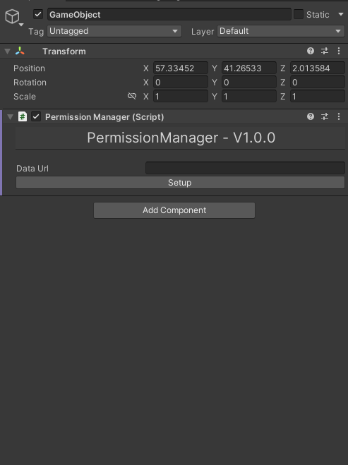

# PermissionManager

## Guide To Setup

1. Create An Empty GameObject

2. Add `PermissionManager.cs` To The New GameObject

3. Open Project Settings -> Player -> Scripting Define Symbols

4. Add `MAGMAMC_PERMISSIONMANAGER` To The Scripting Define Symbols

5. On The GameObject You Have Created Click `Setup`

